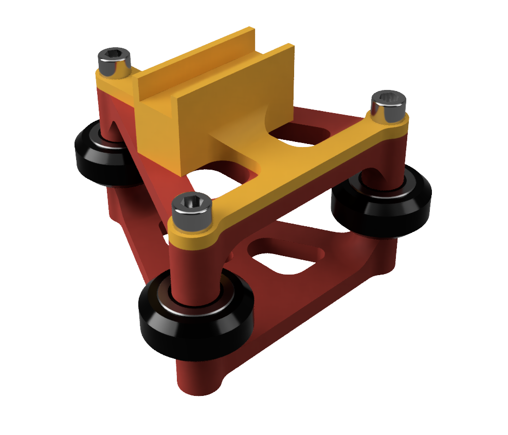

# Camera Slider
This is a motorized camera slider I'm working on, which uses aluminum v-slot, two Nema 17 stepper motors, and some custom 3D printed parts.

This is a rendering of the 3D printed gantry, which is what I'm currently using for testing. However, I'm planning on making an aluminum gantry which will be much more rigid and should reduce vibration.

